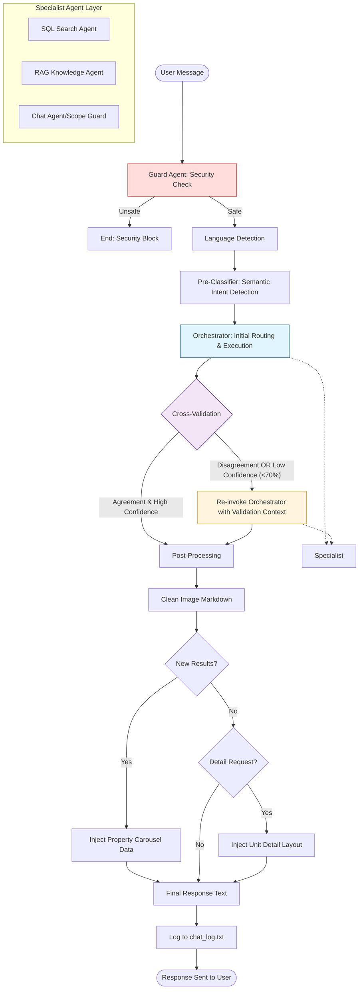

# Chatbot System Workflow

This diagram describes the complete processing flow of the real estate chatbot, including security filtering, semantic intent classification, cross-validation, and post-processing.

## Logic Breakdown

1.  **Security Guard**: Fast filtering to block malicious or harmful input.
2.  **Semantic Intent Pre-Classifier**: Uses a lightweight LLM call to predict if the user wants information (`rag`), search (`sql`), or general chat (`chat`).
3.  **Initial Orchestration**: The LangChain agent chooses a tool.
4.  **Cross-Validation (The "Check")**:
    *   If the Pre-Classifier and Orchestrator **disagree**, or if the pre-classifier's **confidence is low**, the system re-invokes the orchestrator with an explicit "Validation Required" prompt.
    *   This forces the LLM to rethink its routing decision before providing a final answer.
5.  **Post-Processing**:
    *   Cleans up forbidden image links/markdown.
    *   Detects if new units were searched and injects structured JSON for the frontend carousel.
    *   Detects if specific unit details were requested and injects the detailed view layout.
6.  **Scope Guard (In-Agent)**: Even within the specialists, strict real estate scope is enforced at the prompt level.
